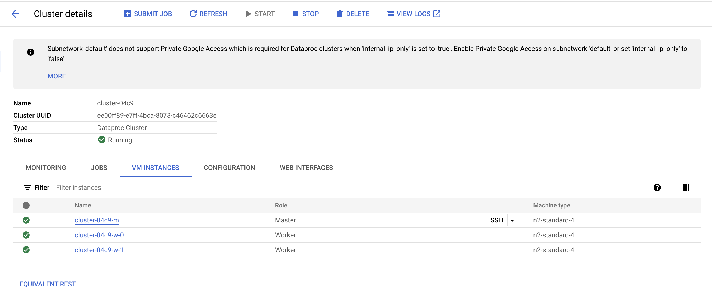
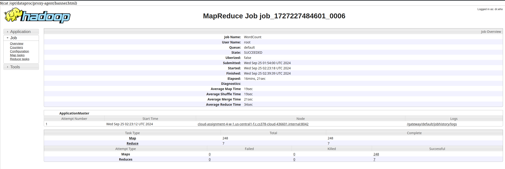
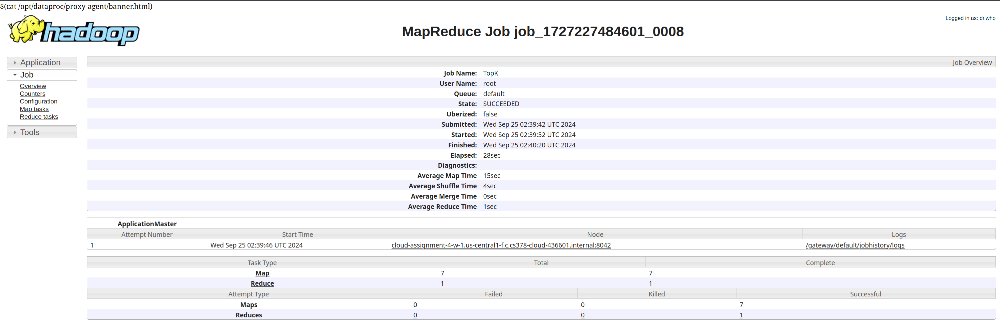

# Please add your team members' names here. 

## Team members' names 

1. Student Name: Karnika Choudhury

   Student UT EID: kc45756

2. Student Name: Samrut Gadde

   Student UT EID: sg53989

3. Student Name: Kshitij Kapoor

   Student UT EID: kk36592

4. Student Name: Navya Agrawal

   Student UT EID: na27378

 ...

##  Course Name: CS378 - Cloud Computing 

##  Unique Number: 51515
    


# Add your Project REPORT HERE 

## Task 1
1    227452
2    176113
3    135791
4    105692
5    81900
6    66481
7    121014
8    197056
9    237868
10    248310
11    241876
12    248226
13    264040
14    263512
15    276763
16    275919
17    243519
18    272288
19    331075
20    344939
21    323571
22    319305
23    309237
24    276934

## Task 2
00DC83118CA675B9A2876C35E3398AF5    100.0
0219EB9A4C74AAA118104359E5A5914C    100.0
022B8DF4D6D7C4DCF11233DD74C9E189    100.0
02510B3B0E797E51AF73361185F62D0B    100.0
FF96A951C04FBCEDE5BCB473CF5CBDBF    100.0

## Task 3
2CB4FE05D307D6294A6E31C00E5F2755    132.63973333333334
E77A964307CF49B32AD77E298A4951D0    120.8667256637169
8CBAFBD97A86B7CC787401F7BBCA3F9D    106.28571428571428
9DAAD7BFA53C91605104DD1874EF97E4    87.18989690721644
C46F08489A5517D480B4DB06F691FD08    78.0
6169ACE14EFA2D65E1FA51BEDC02B38C    48.0
6512BD43D9CAA6E02C990B0A82652DCA    29.63888888888889
AD61AB143223EFBC24C7D2583BE69251    29.025338983050844
44071EFED3705830B4A4A18936D30442    24.527499999999996
EF9FC4F75F09AC6F214EE4C94D61612E    24.0

## Screenshots
Dataproc - Cluster Details


Yarn History Task 1


Yarn History Task 2


Yarn History Task 3




# Project Template

# Running on Laptop     ####

Prerequisite:

- Maven 3

- JDK 1.6 or higher

- (If working with eclipse) Eclipse with m2eclipse plugin installed


The java main class is:

edu.cs.utexas.HadoopEx.WordCount 

Input file:  Book-Tiny.txt  

Specify your own Output directory like 

# Running:


## Create a JAR Using Maven 

To compile the project and create a single jar file with all dependencies: 
	
```	mvn clean package ```


## Run your application
Inside your shell with Hadoop

Running as Java Application:

```java -jar target/MapReduce-WordCount-example-0.1-SNAPSHOT-jar-with-dependencies.jar taxi-data-sorted-small.csv  output final ``` 

Or has hadoop application

```hadoop jar target/MapReduce-WordCount-example-0.1-SNAPSHOT-jar-with-dependencies.jar  taxi-data-sorted-small.csv output final```


## Create a single JAR File from eclipse


Create a single gar file with eclipse 

*  File export -> export  -> export as binary ->  "Extract generated libraries into generated JAR"
